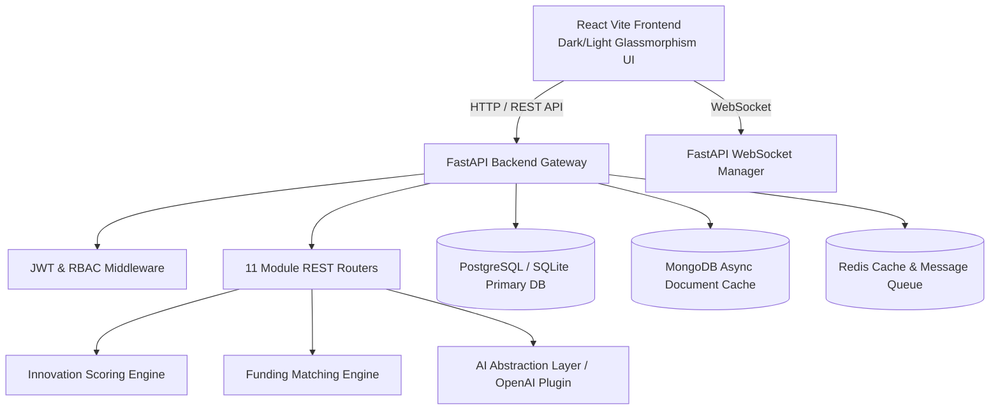

# AI Research Funding & Innovation Intelligence Platform

An enterprise-grade, full-stack **AI Research Funding & Innovation Intelligence Platform** engineered to connect researchers, universities, startups, innovation centers, and government bodies.

---

## 🌟 Key Features

1. **User & Profile Management**: Complete JWT Auth, Role-Based Access Control (Researcher, Startup Founder, Innovation Manager, Administrator), and scientific profile tracking.
2. **Smart Funding Discovery & AI Matcher**: Algorithmic match engine pairing researcher domains & keywords with multi-million dollar federal and private grants.
3. **Research Intelligence**: Track publication citation metrics, impact factors, and extract key paper findings using AI abstract processing.
4. **Patent Landscape**: Search 500+ patents, analyze assignee clusters, claim counts, and prior-art filings.
5. **Technology Readiness Radar**: Monitor emerging technology trajectories with TRL 1-9 readiness levels and market growth estimates.
6. **Multi-Factor Innovation Scoring**: Algorithmic scoring evaluating Research Novelty (25%), Patent Strength (20%), Tech Maturity (20%), Market Potential (20%), and Funding Relevance (15%).
7. **Commercialization Hub**: Discover startup spin-off recommendations, licensing deals, productization paths, and industry partnerships.
8. **Real-time Notifications**: WebSockets-driven persistent alerts for grant eligibility, patent citations, and system events.
9. **Exportable Reports**: Generate verified CSV and digest reports for executive presentation.
10. **Role-Based Admin Panel**: System audit log inspector, user account toggle, and database re-seeder controls.

---

## 🏗 System Architecture



---

## 🚀 Quick Start Guide

### Prerequisites
- Python 3.10+
- Node.js 18+
- Docker & Docker Compose (Optional)

### Option 1: Standalone Local Execution (Fastest Setup)

#### 1. Backend Setup
```bash
cd backend
pip install -r requirements.txt
uvicorn app.main:app --reload --port 8000
```
*The backend automatically creates a SQLite database (`research_platform.db`) and seeds 10 sample users, 5 grants, publications, patents, tech trends, and scores.*

- **FastAPI Interactive Docs**: [http://localhost:8000/api/v1/docs](http://localhost:8000/api/v1/docs)

#### 2. Frontend Setup
```bash
cd frontend
npm install
npm run dev
```
- Access the web interface at **[http://localhost:3000](http://localhost:3000)**

---

### Option 2: Docker Compose Setup
To run the full stack with PostgreSQL, MongoDB, Redis, FastAPI, and NGINX React:

```bash
docker-compose up --build
```

---

## 🔑 Demo Login Credentials

All demo accounts use password: `Password123!`

| Role | Email | Organization |
|---|---|---|
| **Researcher** | `researcher@university.edu` | MIT AI Lab |
| **Startup Founder** | `startup@techventures.io` | Quantum Dynamics Corp |
| **Innovation Manager** | `manager@innovation.gov` | National Science Foundation |
| **Administrator** | `admin@platform.ai` | Global Innovation Institute |

---

## 🧪 Running Unit Tests

```bash
cd backend
pytest tests
```
